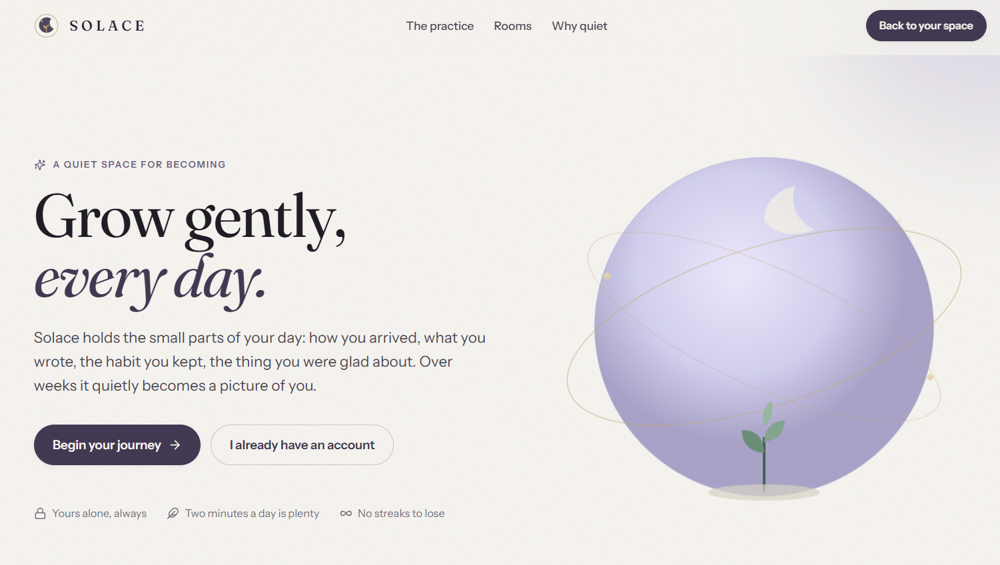
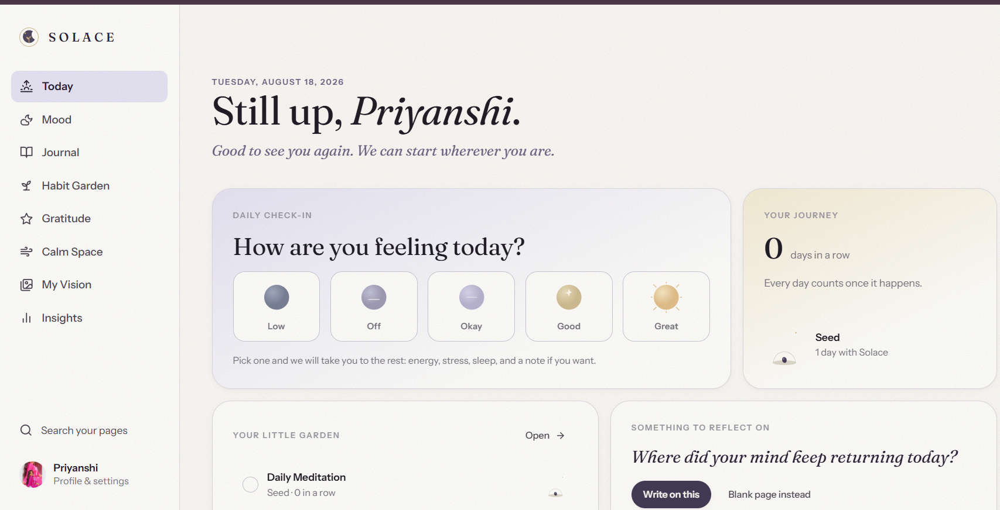
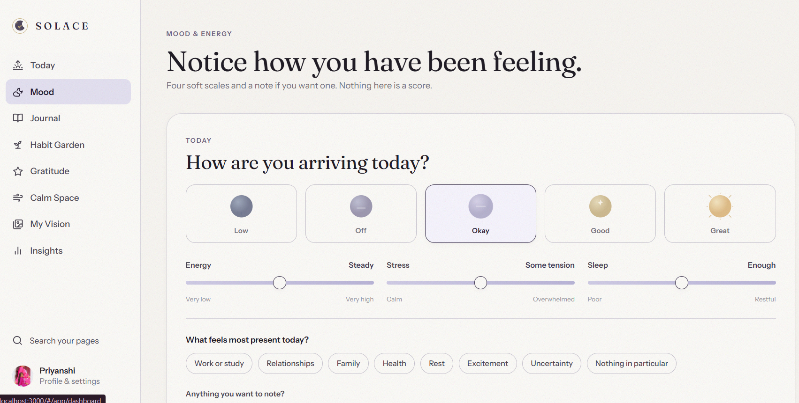
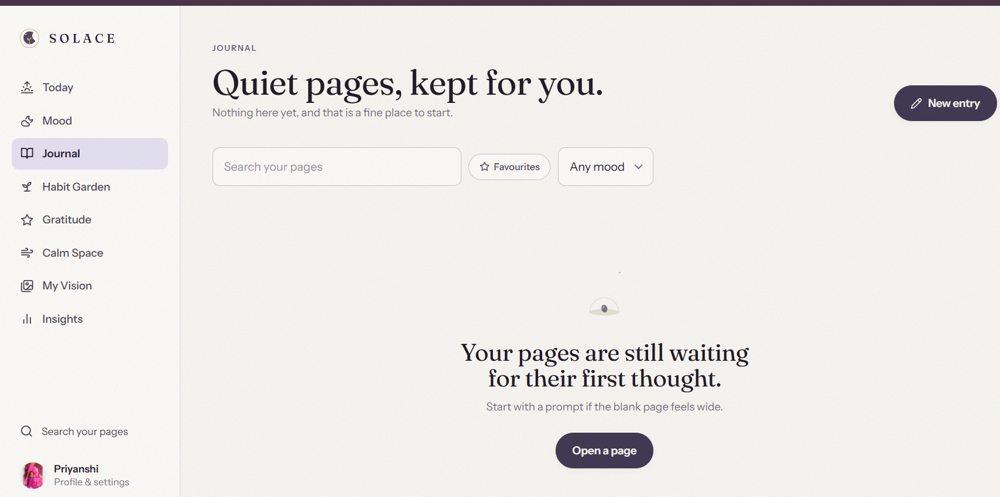
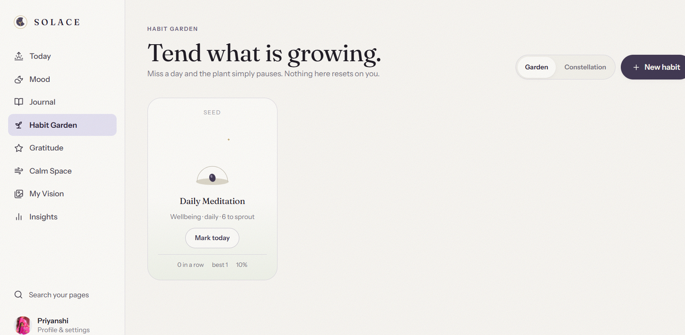
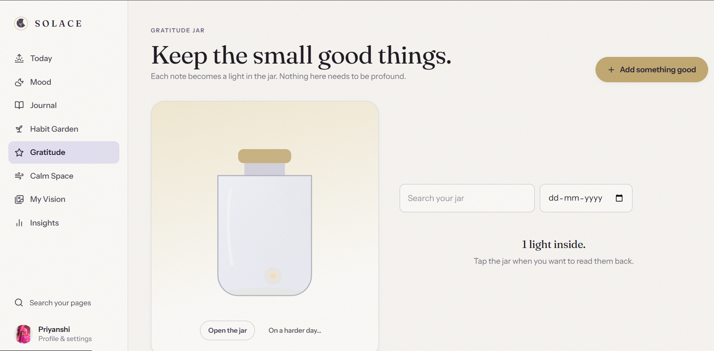
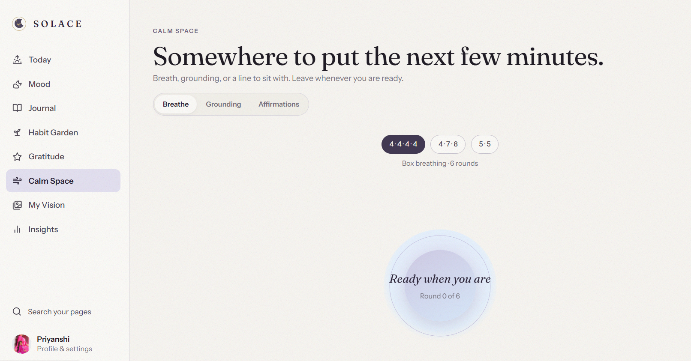
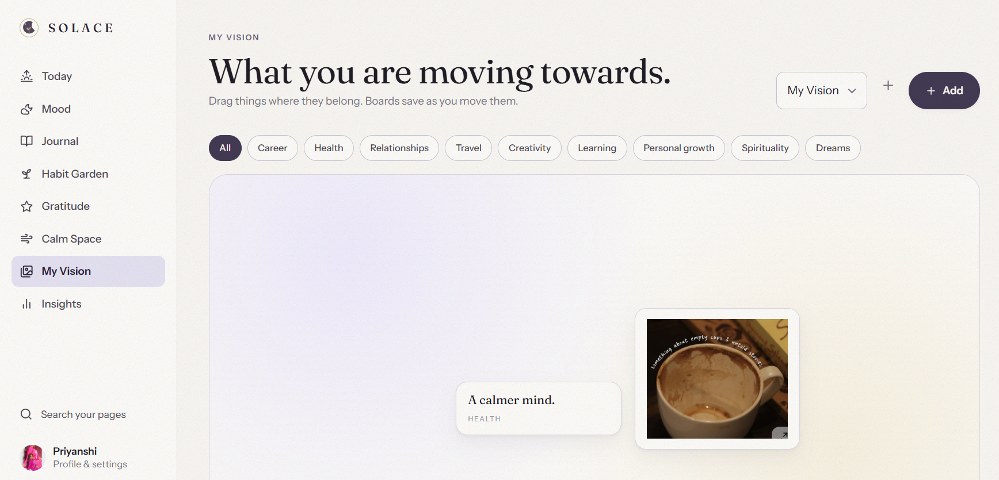
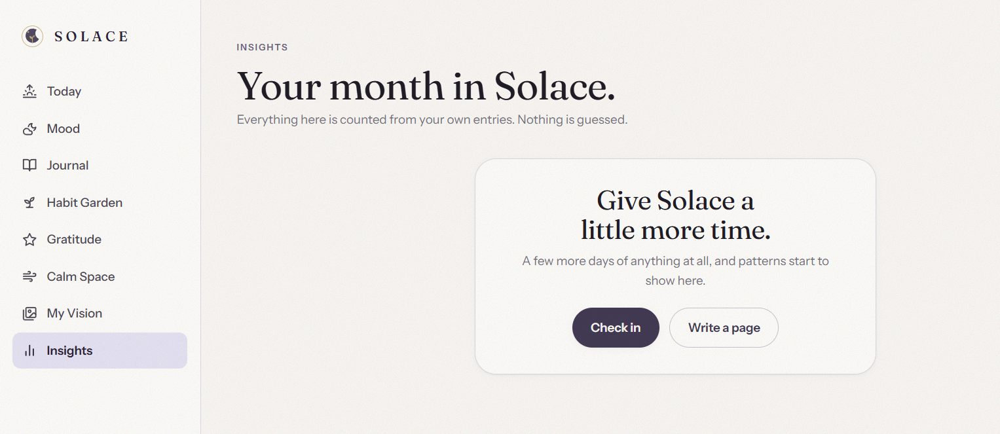

# 🌙 Solace — A Mental Wellness Companion

> A calm, private space to understand your emotions, build gentle habits, reflect through journaling, practice gratitude, and find a moment of calm when life feels overwhelming.

Solace is a full-stack mental wellness web application designed around **self-awareness and self-compassion rather than productivity pressure**. It brings mood tracking, journaling, habit building, gratitude, breathing exercises, vision planning, and personal insights together in one peaceful digital space.


---

## 📖 About the Project

Many productivity and habit-tracking applications revolve around streaks, targets, and constant progress. While useful, that approach can sometimes turn self-care into another task to complete.

**Solace takes a gentler approach.**

Instead of punishing missed days, habits can simply pause. Gratitude entries become glowing lights inside a virtual jar rather than another checklist. Personal goals live on an interactive vision board instead of a rigid task list.

The idea behind Solace is simple:

> **Wellness doesn't have to be another thing you're trying to win at.**

The application combines a warm, calming interface with persistent data storage and authentication to create a wellness companion that is both visually thoughtful and functional.

---

## ✨ Features

### 🏠 Today Dashboard
A peaceful daily overview that brings together the most important parts of Solace and makes daily check-ins easy to access.

### 🌤️ Mood Tracker
Record and understand emotional patterns over time.

- Log daily mood
- Track energy levels
- Record sleep and stress
- View trends across **7, 30, and 90 days**
- Explore entries through calendar and history views

### 📖 Journal
A private space for free-form reflection where users can write about their thoughts, emotions, experiences, or anything they want to remember.

### 🌱 Habit Garden
Turns habit building into something visual and encouraging.

Habits gradually grow through stages:

`Seed → Sprout → Bloom`

Features include:

- Current streak tracking
- Best streak tracking
- Visual plant growth
- Gentle progress without punishing missed days
- Alternate **Constellation View**

### ✨ Gratitude Jar
Capture small moments worth remembering.

Each gratitude entry appears as a glowing light inside a virtual jar, creating a visual collection of positive moments over time.

Entries can also be searched and filtered by date.

### 🫧 Calm Space
A dedicated space for slowing down and resetting.

Includes guided exercises such as:

- **Box Breathing** — 4-4-4-4
- **4-7-8 Breathing**
- **5-5 Breathing**
- Grounding exercises
- Positive affirmations

### 🎯 My Vision
An interactive drag-and-drop vision board for organizing personal goals and aspirations.

Categories include:

- Career
- Health
- Relationships
- Travel
- Creativity
- Learning
- Personal Growth
- Spirituality
- Dreams

### 📊 Insights
Brings together information from different parts of Solace to help users recognize patterns across their:

- Mood
- Habits
- Journaling activity
- Wellness journey

### 🔐 Authentication
Solace includes user authentication and protected personal data using:

- Account registration
- Secure login
- Password hashing with bcrypt
- JWT-based authentication
- User-scoped records

---

## 🖼️ Screenshots

### Landing Page


### Today Dashboard


### Mood Tracker


### Journal


### Habit Garden


### Gratitude Jar


### Calm Space


### My Vision Board


### Insights


---

## 🛠️ Tech Stack

| Layer | Technology |
| --- | --- |
| **Frontend** | HTML5, CSS3, Vanilla JavaScript |
| **Architecture** | Single Page Application with hash-based routing |
| **Backend** | Node.js, Express.js |
| **Database** | SQLite |
| **SQLite Driver** | `better-sqlite3` |
| **Authentication** | bcrypt + JSON Web Tokens (JWT) |
| **API** | REST-style user-scoped endpoints |
| **Other** | CORS, environment configuration, health-check endpoint |

---

## 📂 Project Structure

```text
solace-project/
│
├── frontend/
│   └── solace.html          # Main self-contained frontend application
│
├── backend/
│   ├── server.js            # Express server and API routes
│   ├── package.json         # Backend dependencies and scripts
│   └── .env.example         # Example environment configuration
│
├── screenshots/
│   ├── 01-landing.png
│   ├── 02-today.png
│   ├── 03-mood-tracker.png
│   ├── 04-journal.png
│   ├── 05-habit-garden.png
│   ├── 06-gratitude-jar.png
│   ├── 07-calm-space.png
│   ├── 08-my-vision.png
│   └── 09-insights.png
│
└── README.md
```

---

## 🚀 Getting Started

### Prerequisites

Make sure you have **Node.js 22.x–26.x** and npm installed.

Check your installation with:

```bash
node --version
npm --version
```

### 1. Clone the Repository

```bash
git clone <your-repository-url>
cd solace-project
```

### 2. Install Backend Dependencies

```bash
cd backend
npm install
```

### 3. Configure Environment Variables

Create a `.env` file using `.env.example` as a reference.

**Windows PowerShell:**

```powershell
Copy-Item .env.example .env
```

**macOS/Linux:**

```bash
cp .env.example .env
```

Then replace the example JWT secret with your own secure value.

```env
SOLACE_JWT_SECRET=your_secure_secret_here
```

> ⚠️ Never commit your real `.env` file or secret keys to GitHub.

### 4. Start the Backend

```bash
node server.js
```

The backend will start locally on:

```text
http://localhost:3000
```

### 5. Open the Frontend

Open:

```text
frontend/solace.html
```

in a modern web browser.

---

## 🔒 Privacy & Security

Mental wellness information can be deeply personal, so privacy is an important part of Solace's design.

The backend implements:

- Password hashing using **bcrypt**
- JWT-based authentication
- User-scoped database records
- Environment-based secret configuration
- Local SQLite persistence

> **Note:** Solace is an educational wellness project and is not intended to replace professional mental health care, diagnosis, or treatment.

---

## 💡 Design Philosophy

Solace is built around four principles:

**Gentle over demanding**  
Missing a day shouldn't erase your progress.

**Reflection over performance**  
The goal is understanding yourself, not maximizing metrics.

**Visual over clinical**  
Gardens, glowing gratitude lights, and vision boards make wellness tracking feel more personal.

**Private by design**  
Personal reflections and wellness information belong to the user.

---

## 🔮 Future Improvements

- [ ] Connect all frontend data flows directly to the backend API
- [ ] Add gentle daily reminders and notifications
- [ ] Add journal and mood-history data export
- [ ] Improve mobile responsiveness
- [ ] Add optional end-to-end encryption for journal entries
- [ ] Add richer long-term wellness insights
- [ ] Add customizable themes
- [ ] Expand accessibility support

---

## 📄 License

This project is licensed under the **MIT License**.

---

## 👩‍💻 Author

**Priyanshi Kumari**  
MCA Student  
Guru Gobind Singh Indraprastha University

 · [Email](mailto:priyanshichaudhary58@gmail.com)

---

<p align="center">
  Made with 🌙 for slower days, softer habits, and a little more Solace.
</p>
